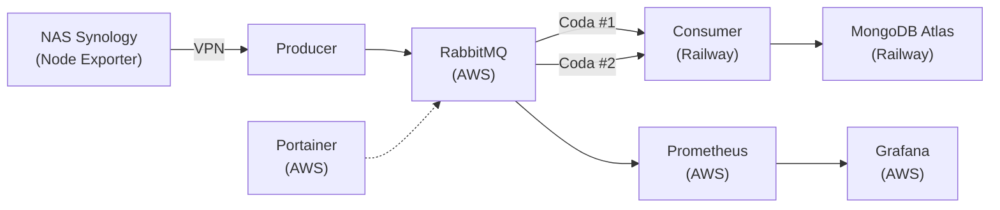

# RabbitWatch – Architettura e Flusso Metriche

## Schema Architetturale

**Legenda:**
- **AWS:** RabbitMQ, Prometheus, Grafana, Portainer
- **Railway:** Consumer, MongoDB Atlas
- **NAS Synology:** dietro VPN, trasmette metriche tramite Node Exporter

---

## Checklist Modifiche Architettura

- [ ] Deploy RabbitMQ, Prometheus, Grafana, Portainer su AWS
- [ ] Deploy Consumer e MongoDB Atlas su Railway
- [ ] Configurare VPN tra NAS Synology e Producer
- [ ] Aggiornare i flussi producer/consumer per lavorare con RabbitMQ/MongoDB su AWS/Railway
- [ ] Aggiornare la documentazione

---